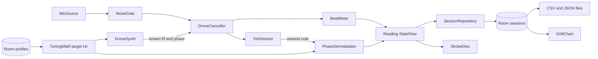

# Beatwheel: the strobe tuner that holds a drone while it listens

Ensemble players need two things a free needle app never gives them: a drone to play into until the beats stop, and proof of how far the section sagged by the second movement. Beatwheel's tangerine strobe disc turns when you are off and stands still when you are on, a drone sounds while the meter keeps measuring, and a drift chart records a held note for up to an hour as CSV. One price, no ads, no nag, no internet permission.

## 1. Overview

- **Elevator pitch:** a strobe tuner with a drone that sounds while it listens, a rehearsal drift chart, temperaments and transposition, sold once.
- **Play category:** Music and Audio.
- **Tagline:** The strobe tuner that holds a drone while it listens.
- **Play positioning line:** The one-price, nag-free strobe tuner for ensemble players who tune against a drone and watch pitch drift, not another guitar needle.
- **Names:** display name Beatwheel; Play title `Strobe Tuner: Chromatic, Drone`, the refuter's sharpened title. Package `com.mohdshayan.beatwheel`.
- **Price:** USD 3.99, INR 149.

## 2. Problem and why now

The buyer does intonation work: wind and string players, band directors, early-music players at A 415. Demand is proven. Strobe Tuner Pro sells at USD 4.99 with 50K+ installs and 4.5 on 1.31K ratings (https://play.google.com/store/apps/details?id=com.a4tune.strobe); modelled installs grew from 28.6K in mid 2023 to 52.6K by 2026 with about nine new ratings a month, the healthiest paid tool curve measured (https://play.google.com/store/search?q=guitar%20tuner&c=apps&price=2). The paid "strobe tuner" filter shows about a dozen listings from USD 1.99 to 13.99 (https://play.google.com/store/search?q=strobe%20tuner&c=apps&price=2), TonalEnergy among them at 5.99 (https://play.google.com/store/apps/details?id=com.sonosaurus.tonalenergytuner).

The free field is strong: nine of ten page-one "chromatic tuner" results are free (https://play.google.com/store/search?q=chromatic%20tuner&c=apps). gStrings free (10M+, 4.7) has historical temperaments and ads (https://play.google.com/store/apps/details?id=org.cohortor.gstrings). Airyware has true strobe behind a 30-second nag (https://play.google.com/store/apps/details?id=airyware.tuner). StroboPro owns harmonic strobes, free with IAP (https://play.google.com/store/apps/details?id=se.applicaudia.strobopro). Moessner's open-source Tuner is ad-free with Werckmeister and a pitch graph (https://play.google.com/store/apps/details?id=de.moekadu.tuner).

**Why a buyer pays anyway:**

1. **Drone and meter at once.** The refutation found a drone that keeps sounding while the tuner listens is what free strobe apps lack; only TonalEnergy partly covers drone plus drift. Beatwheel tunes the drone to the meter and subtracts it from the microphone on the speaker.
2. **A rehearsal record.** Moessner's Tuner draws pitch over time; Beatwheel saves named hour-long sessions with worst sag in cents, as CSV a director can show a section.
3. **Nothing between notes.** gStrings free shows ads, Airyware nags. "Tuner no ads" is this buyer, and the listing states no INTERNET permission.
4. **Under the paid anchors:** USD 3.99 against 4.99, 5.99 and 10.

The refuter's newcomer ceiling is about 30 to 150 sales a month; the build is sized to it.

## 3. Target audience and personas

- **Margriet Vos, 52, baroque oboist, Utrecht.** Plays at A 415 in Werckmeister III. Types **"strobe tuner"**, filters Paid. She pays when a screenshot shows A 415, Werckmeister III and a reed drone with no ad banner.
- **Tomás Herrera, 34, high-school band director, San Antonio, Texas.** His trumpet section sags. Types **"tuner no ads"**. He pays at the drift chart and the B flat preset showing written notes.
- **Anjali Deshpande, 29, harmonium player and teacher, Pune.** Checks reeds against a Sa drone. Types **"chromatic tuner"**. She pays INR 149 when the harmonium profile holds steady on a held reed, with just intonation on her tonic.

## 4. Core concept deep-dive

**How it works.** `AudioRecord` feeds 48 kHz mono float blocks to an audio thread, where YIN with parabolic interpolation picks the nearest note. Then Beatwheel does what a physical strobe does: it demodulates the signal against a quadrature oscillator at the exact target frequency (reference, temperament and transposition applied) and reads the low-passed phase. That phase turns at the frequency difference, so the disc angle is the phase itself, and cents come from its slope, resolving a tenth of a cent on a steady tone.

**The drone.** `AudioTrack` in low-latency streaming mode plays a sine, reed or saw wavetable through the meter's tuning. Headphones keep it off the microphone. On speaker, `DroneCanceller` takes the synthesised drone as reference and tracks the speaker-to-microphone gain and phase of its fundamental and first eight harmonics by recursive least squares with a 2-second forgetting constant, then subtracts them. Each partial becomes a notch under 1 Hz wide: the room path is steady, so a player a few hertz away survives. When the player's note lies within 1.5 Hz of a drone partial (about 6 cents at A4) the tones cannot be honestly separated, so the readout switches to beats per second and the disc turns at the beat rate, signed by the residual phasor's rotation.

**The one memorable thing.** The disc that stops. Four rings of tangerine segments on slate drift clockwise when sharp, anticlockwise when flat, and freeze at pitch. No green light, no tick: stillness is the signal.

**What it refuses to do.** Write audio to disk, listen in the background, run a metronome, track harmonics, tune drums, show ads or ask for an account.

## 5. Complete feature set

**v1.0:**

1. **Strobe disc** at display refresh rate driven by demodulated phase, plus a **needle view**; note, cents and Hz to 0.1, readable at arm's length.
2. **Reference A 415.0 to 466.0 Hz** in 0.1 Hz steps per profile, with chips for 415, 430, 440, 442 and 466.
3. **Temperaments:** equal, just, Pythagorean, quarter-comma meantone, Werckmeister III, Kirnberger III and custom offsets, on any tonic.
4. **Transposition:** concert, B flat, E flat, F and G, written note large, sounding note beside it.
5. **Drone** in sine, reed and saw, octaves 2 to 5, sounding while the tuner listens, with speaker cancellation and beats per second near unison.
6. **Drift sessions:** ten readings a second for up to 60 minutes; chart, start, end, range, cents per minute.
7. **Fifteen profiles:** Chromatic, Guitar, Ukulele, Violin, Viola, Cello, Double bass, Flute, Oboe, Clarinet in B flat, Alto sax in E flat, Tenor sax in B flat, Trumpet in B flat, Horn in F, Harmonium; copy any to customise.
8. **Held-tone mode** on Harmonium and Oboe: a longer averaging window for sustained reeds.
9. **Noise gate and sensitivity** with a live level meter.
10. **Stand mode:** full screen, screen kept on, any orientation, two panes on tablets.
11. **Export and import:** session CSV and a full JSON backup through the document picker or share sheet.
12. **Works with the microphone denied:** drone, profiles and sessions stay usable.

**v1.x:** a quick settings tile into Stand mode; overlaying two sessions. **v2:** multi-note ensemble sessions with a sag table; a Wear OS cents glance.

**Cut, per the refutation:** tabla-adjacent ranges; the 400+ instrument race; harmonic-by-harmonic strobes; separate "violin tuner offline" and "harmonium tuner" keyword pushes. **Cut for policy:** background recording, which would need a microphone foreground service; a session records only on screen and marks gaps.

## 6. Screen-by-screen UX

**Navigation.** **Tune**, **Sessions**, **Profiles**: a bottom `NavigationBar` under 600dp, a `NavigationRail` above. Settings is a Tune top-bar icon; Stand is a full-screen route.

- **Tune (home):** profile dropdown; disc or needle, written note with drawn accidental, cents, Hz, sounding note; drone strip (note, waveform, volume, "Start drone"); "Record drift". First launch shows the microphone rationale in the disc's place.
- **Stand:** disc and note at maximum size; a tap reveals controls briefly.
- **Record drift (sheet):** elapsed time, live trace, "Stop and save", name prefilled.
- **Sessions:** newest first, grouped by week with spacing; overflow "Import backup".
- **Session detail:** chart (cents against minutes, zero line Ink, trace Neon), summary, note, "Export CSV", "Share", "Delete session".
- **Profiles:** built-ins then custom rows; tap selects, overflow edits, copies or deletes.
- **Profile editor:** every profile field from section 9, "Save profile".
- **Temperament editor:** twelve cents fields (-50.0 to +50.0) with "Play" each, "Save temperament".
- **Settings:** display, theme, sensitivity, waveform, "Export backup", "Import backup", local counts, privacy policy, licences.

**Flow 1, drone (Margriet):** Tune, Oboe, A 415 and Werckmeister III, drone on A, "Start drone", she plays, the readout turns to beats per second, the disc stops, she moves the staple and plays again.

**Flow 2, drift (Tomás):** Tune, Trumpet in B flat, "Record drift", the section checks a written C through a forty-minute rehearsal in Stand mode, "Stop and save" as "Tuesday brass", "Export CSV", share to email.

**Flow 3, denied microphone (Anjali):** rationale "Beatwheel listens to your instrument to measure pitch. No audio is saved.", "Allow microphone", she declines, error with "Open settings", she still starts a Sa drone, grants later, the disc starts.

## 7. Design system

**Reading this as:** a precision instrument for ensemble musicians, with a laboratory-strobe language, leaning toward Barlow Semi Condensed plus Atkinson Hyperlegible Next on a **slate and neon tangerine** palette.

**Dials.** Variance 3: instruments are read at a glance, so layouts centre on the disc. Motion 2: only the disc moves unprompted, because it is data. Density 4: sparse tuner, plain lists.

**Colour tokens:**

| Token | Light | Dark | Role |
|---|---|---|---|
| Stand | #EFF2F4 | #12171C | background, surface, window |
| Case | #DFE4E8 | #1C232A | drone strip, sheets, fields, surfaceVariant |
| Ink | #18212A | #E3E8EC | text, primary button fill, zero line, primary, error |
| Graphite | #4F5B66 | #9AA6B1 | secondary text, axis labels, onSurfaceVariant |
| Rule | #B9C2CA | #34404A | dividers, disc outline skeleton, slider track, outline |
| Neon | #C85A26 | #E8844A | the one accent: strobe segments, drift trace, slider thumb, selected outline |

Neon saturation is 68 percent light, 77 percent dark. Measured contrast: Ink on Stand 14.5:1; Graphite on Stand 6.2:1 light, 7.3:1 dark; Neon on Stand 3.8:1 light, 6.7:1 dark, on Case 3.3:1 light, so Neon marks and 24sp-plus numerals only, never body text. Strobe gaps are the Stand ground, never Rule (Neon on Rule is 2.4:1 light). Primary buttons are Ink with a Stand label; errors use Ink and an outlined icon. Dynamic colour off.

**Type.** Barlow Semi Condensed (Google Fonts, SIL OFL 1.1): SemiBold 600 for the note letter (112sp Tune, 180sp Stand), Medium 500 for titles at 22sp. Atkinson Hyperlegible Next (Google Fonts, SIL OFL 1.1, variable `wght` TTF set through `FontVariation.Settings`): body 16sp 400, labels 14sp 500, cents and Hz 700 with `fontFeatureSettings = "tnum"`. Both carry `tnum`; neither has sharp or flat glyphs, so accidentals are `ImageVector`s and TalkBack reads "B flat". Licences go to `docs/OFL-BarlowSemiCondensed.txt` and `docs/OFL-AtkinsonHyperlegibleNext.txt`.

**Radius scale.** RadiusSm 4dp chips and fields, RadiusMd 10dp buttons and drone strip, RadiusLg 20dp sheet tops. Lists are unboxed.

**Icons.** Material Icons Outlined (`material-icons-extended`) at 24dp in Graphite, plus custom vectors for sharp, flat, strobe and tuning fork, each with a `contentDescription` when icon-only.

**Launcher icon direction** (ICON.md): bright tangerine gradient #FB9136 to #EE6618; an Ink slate tuning fork cradling a twelve-wedge strobe disc with a near-white spindle, repeated on the monochrome layer. Ink rather than near-white keeps the mark above 3:1 on a daylight ground and separates it from the rust and white KabutarBaazi icon.

**Motion.** One first-run moment: on the first microphone grant the rings fade in from the centre over 400 ms. Otherwise motion answers actions: the drone strip expands in 200 ms; strobe and needle cross-fade in 150 ms. The disc draws from live phase, not an `animate*` call. Under reduced motion everything `snap()`s and the disc renders still with a Neon rim arc showing the cents offset, legible with animations off; a Settings switch restores rotation.

**States:**

| Screen | Empty | Loading | Error | Success |
|---|---|---|---|---|
| Tune, Stand | still disc, "Play a note" | disc outline skeleton | "Beatwheel needs the microphone to measure pitch." + "Open settings"; busy mic: "Another app is using the microphone." + "Try again" | disc still, 0.0 cents |
| Record drift | "Hold a note to start the trace" | none | gap marker "Paused in the background" | "Session saved" |
| Sessions | "No sessions yet. Record a held note from Tune." + "Record drift" | row skeletons | "This file is not a Beatwheel backup." | "Backup imported" |
| Session detail | "No readings in this session" | chart skeleton | "Could not write the file. Choose another location." | "CSV exported" |
| Profiles, editors | built-ins always present | list skeleton | inline "Enter a value from 415.0 to 466.0" | "Profile saved" |
| Settings | not applicable | none | as Session detail | "Backup exported" |

**Access and large screens.** WCAG AA both modes; 48dp targets; `Scaffold` insets; text scales to 200 percent. At 600dp Tune splits into disc left, drone and profile right; rotation keeps ViewModel state without restarting audio.

**Screenshots.** Six 1080x1920 (1 to 4 light, 5 and 6 dark) from a debug build fed by the synthetic source, no overlay, so readings are real DSP output: Oboe at A 415 with the disc still; reed drone with beats per second; a 42-minute brass sag; temperament picker; Clarinet in B flat written D sounding C; Stand mode on Harmonium.

## 8. Native architecture

**Generator flags line:**

`new-native-app.sh --name "Beatwheel" --pkg com.mohdshayan.beatwheel --perms "RECORD_AUDIO" --room --orient unspecified --bg "#EFF2F4" --bg-dark "#12171C"`

**Modules.** `:app` only; DSP and music logic sit in `core/` packages with no Android imports, tested under `app/src/test`. No Oboe: `AudioRecord` and `AudioTrack` in Kotlin, per the recipe.

**Package map** (`com.mohdshayan.beatwheel`):

- `core/pitch` (`YinDetector`, `PhaseDemodulator`, `PitchEstimator`, `NoiseGate`), `core/music` (`TuningMath`, `Temperaments`, `Transposition`), `core/drone` (`Wavetables`, `DroneCanceller`, `BeatMeter`), `core/drift` (`DriftSummary`, `SessionCsv`, `BackupModels`)
- `audio`: `MicSource` (built-in mic via `setPreferredDevice`, `UNPROCESSED` source when supported, else `VOICE_RECOGNITION`), `DroneSynth` (`PERFORMANCE_MODE_LOW_LATENCY`, `USAGE_MEDIA`, audio focus), `AudioEngine` (urgent-audio thread, conflated `StateFlow<Reading>`); `SyntheticSignalSource` in `app/src/debug` only
- `data/db`, `data/prefs`, `data/repo` (profiles seeded on first open, readings batched each second, backup)
- `ui/tuner`, `ui/stand`, `ui/sessions`, `ui/session`, `ui/profiles`, `ui/settings`, `ui/components`, `ui/nav`, `ui/theme`; `review/ReviewPrompter`

**Lifecycle.** `AndroidViewModel`s with `stateIn(WhileSubscribed(5_000))`. The `AudioEngine` singleton starts on `ON_START` and stops on `ON_STOP` in Tune and Stand; `FLAG_KEEP_SCREEN_ON` while Stand or a recording shows.

**Catalog aliases:** `androidx-core-ktx`, `androidx-core-splashscreen`, `androidx-lifecycle-runtime-ktx`, `androidx-lifecycle-runtime-compose`, `androidx-lifecycle-viewmodel-compose`, `androidx-activity-compose`, `androidx-compose-bom`, `androidx-ui`, `androidx-ui-graphics`, `androidx-ui-tooling`, `androidx-ui-tooling-preview`, `androidx-material3`, `androidx-material-icons-extended`, `androidx-navigation-compose`, `androidx-room-runtime`, `androidx-room-ktx`, `androidx-room-compiler`, `androidx-datastore-preferences`, `kotlinx-coroutines-android`, `kotlinx-coroutines-test`, `kotlinx-serialization-json`, `junit`; uncomment `androidx-window`; add `play-review-ktx` for `com.google.android.play:review-ktx:2.0.2`. Plugins: `android-application`, `kotlin-android`, `kotlin-compose`, `kotlin-serialization`, `ksp`.

**Hardware and assets.** Microphone and speaker. Three TTFs, about 330 KB, SIL OFL 1.1; profiles and temperaments are Kotlin constants; no models or samples.

**Permissions:**

- `android.permission.RECORD_AUDIO`: the tuner listens to the instrument to measure pitch; audio is analysed in memory, never stored or sent.

Nothing else: no INTERNET, foreground service, WAKE_LOCK or storage permission.

**Background work.** None: tuning and recording are foreground activities. No WorkManager, alarms, widgets or tiles.



## 9. Data model

**Room** (version 1, `exportSchema = false` until shipped):

- `InstrumentProfile`: `id: Long` PK, `name: String`, `builtInKey: String?`, `transpositionSemitones: Int`, `referenceAHz: Double`, `temperamentKey: String` (`equal`, `just`, `pythagorean`, `meantone_qc`, `werckmeister3`, `kirnberger3`, `custom:<id>`), `tonicPitchClass: Int`, `keepReferenceA: Boolean`, `minHz: Double`, `maxHz: Double`, `stringTargetsMidi: String`, `heldToneMode: Boolean`, `noiseGateDb: Float`, `sortOrder: Int`.
- `CustomTemperament`: `id: Long` PK, `name: String`, `offsetsCents: String` (twelve values, C to B), `createdAt: Long`.
- `DriftSession`: `id: Long` PK, `name: String`, `note: String`, `profileName: String`, `referenceAHz: Double`, `temperamentName: String`, `transpositionSemitones: Int`, `startedAt: Long`, `durationMs: Long`, `readingCount: Int`, `startCents`, `endCents`, `minCents`, `maxCents`, `driftCentsPerMinute` (all `Float?`).
- `DriftReading`: `id: Long` PK, `sessionId: Long` (FK, cascade, indexed), `offsetMs: Long`, `midi: Int`, `hz: Float`, `cents: Float`, `levelDb: Float`, `gap: Boolean`.

**Preset offsets**, cents from equal temperament, C to B:

- Just: 0, +11.7, +3.9, +15.6, -13.7, -2.0, -9.8, +2.0, +13.7, -15.6, +17.6, -11.7
- Pythagorean: 0, +13.7, +3.9, -5.9, +7.8, -2.0, +11.7, +2.0, +15.6, +5.9, -3.9, +9.8
- Quarter-comma meantone: 0, -24.0, -6.8, +10.3, -13.7, +3.4, -20.5, -3.4, -27.4, -10.3, +6.8, -17.1
- Werckmeister III: 0, -9.8, -7.8, -5.9, -9.8, -2.0, -11.7, -3.9, -7.8, -11.7, -3.9, -7.8
- Kirnberger III: 0, -9.8, -6.8, -5.9, -13.7, -2.0, -9.8, -3.4, -7.8, -10.3, -3.9, -11.7

Offsets rotate to the tonic; with `keepReferenceA` they shift so A reads 0.

**DataStore keys:** `onboarding_done`, `first_run_disc_shown`, `active_profile_id`, `display_mode`, `rotate_disc_reduced_motion`, `theme`, `input_sensitivity`, `drone_waveform`, `drone_volume`, `drone_octave`, `successful_uses`, `last_success_day`, `review_prompted`, `local_counts_enabled`, and four `count_*` integers.

**Export and import.** Session CSV with header `session,started_at,elapsed_s,written_note,sounding_note,target_hz,measured_hz,cents,reference_a_hz,temperament,profile,gap`. Backup `beatwheel-backup-<date>.json` via `CreateDocument`: `{format: 1, exportedAt, profiles, customTemperaments, sessions[{..., readings}]}` with kotlinx-serialization. `OpenDocument` import remaps ids, suffixes clashing profile names with " (imported)", appends sessions, never overwrites built-ins, and rejects files without `format`.

## 10. Pricing and countries

**USD 3.99, INR 149.** Rung: core utility, the top of the market map's USD 2.99 to 3.99 band, matching the refutation's sharpened price. INR 149 (the consumer-log rung's India price, not the creative-tool INR 199) because the Indian buyer compares against free tuners; it is about 42 percent of FX, inside the INR 99 to 300 band. Other emerging markets are hand-set at 25 to 50 percent of USD.

**Launch pricing.** Full price, then 25 percent off (USD 2.99) in week two for the strikethrough badge; never USD 0. **Refunds.** Play's 48-hour automatic refund stands; the disc reads a note in the first minute. Later requests are honoured by email.

**Why this niche pays.** Paid strobe tuners run to USD 13.99 and the volume anchors sit at 4.99 and 5.99. Goal-driven buyers (an audition, a stubborn reed) are less price-elastic, and a dollar under Strobe Tuner Pro is an easy comparison.

## 11. Play Store listing

- **Title:** `Strobe Tuner: Chromatic, Drone` (30 characters)
- **Short description:** `Sub-cent strobe tuner with temperaments, drone and drift chart. No ads, offline.` (80 characters)
- **Full description** (1982 characters; the first three lines carry the purchase reason):

```
A strobe tuner for players who tune against a drone and want to see where their pitch goes over a rehearsal. No ads, no nag screen, no in-app purchases.
The strobe disc stands still when you are in tune and turns slowly when you are not, so a fraction of a cent is visible from a music stand.
Play a sustained drone on any note while the tuner keeps listening, then save a drift chart of a held note and export it as CSV.

One-time purchase. No ads, no subscription, no account. Works fully offline.

Strobe and needle
Sharp turns the disc clockwise, flat turns it back, in tune holds it still. A needle view is one tap away.

A drone that keeps sounding
Sine, reed or saw drone on any note, tuned to the same reference and temperament as the meter. With headphones the drone never reaches the microphone. On the speaker, Beatwheel removes its own drone from what it hears, and near unison it shows the beats per second you hear.

Rehearsal drift chart
Record a held note for up to an hour, see how far it sagged, export CSV.

Reference and temperaments
A from 415 to 466 Hz, remembered per instrument. Equal, just, Pythagorean, quarter-comma meantone, Werckmeister III, Kirnberger III and your own cents offsets on any tonic.

Transposing instruments
B flat, E flat, F and G presets show the written note large and the sounding note beside it.

Fifteen instrument profiles
Chromatic, guitar, ukulele, violin, viola, cello, double bass, flute, oboe, clarinet, alto and tenor saxophone, trumpet, horn and harmonium. Copy any profile to make your own.

Stand mode and loud rooms
Full screen, screen kept on, two panes on tablets. A noise gate keeps the display calm between notes.

Your data
Profiles, temperaments and sessions export to a file and import back. No audio is ever saved: the microphone signal is measured in memory and discarded.

Microphone only. Beatwheel has no internet permission.

Not included: a metronome, harmonic-by-harmonic strobes, or drum and tabla tuning.
```

- **Keywords:** strobe tuner, chromatic tuner, tuner no ads, drone tuner, oboe tuner, clarinet tuner, A 415, Werckmeister, just intonation, offline tuner.
- **Screenshot captions:** 1 "Still means in tune"; 2 "A drone that sounds while you tune"; 3 "See how far a held note drifts"; 4 "A from 415 to 466, six temperaments"; 5 "Written and sounding notes"; 6 "Readable from the stand".
- **Feature graphic:** 1024x500, tangerine gradient, the fork-and-wheel mark at left, "Beatwheel" in Barlow Semi Condensed SemiBold, "Strobe tuner with a drone and a drift chart".
- **Category** Music and Audio; **content rating** Everyone; **target age** 13 and over.
- **Stated plainly:** paid, no ads, no in-app purchases, works offline.

## 12. Policy and data safety

Manifest: RECORD_AUDIO only. Data safety: collected none, shared none; audio is processed ephemerally on device; no analytics, crash or ads SDK. Privacy policy from `make-privacy-policy.py --app "Beatwheel" --org "SocialSure Private Limited" --permissions RECORD_AUDIO --out docs`, without `--collects`, linked in Settings. `data_extraction_rules.xml` excludes all data from cloud backup; the JSON export is the backup. No Health, Financial, Government, News or Families declarations; no advertising ID. The listing must not claim certified accuracy, competitor trademarks, harmonic strobes, drum tuning, "0.1 cent accuracy" (the readout resolves 0.1 cent; accuracy depends on the microphone), or background recording.

## 13. Organic growth

**Search.** The title carries "strobe tuner", "chromatic" and "drone"; the short description adds "temperaments", "drift chart", "no ads" and "offline" for the "tuner no ads" intent. The first three description lines repeat them for Ask Play; instrument and temperament names catch the long tail.

**Review prompt.** `review-ktx`, once, after the third successful use (a note held within 2 cents for two seconds, counted once a day, or a saved drift session), on leaving Tune or after "Session saved"; never on first launch or while audio runs.

**Launch.** A 30-second clip of the disc stopping against a drone, posted to oboe and band-director communities; week-two sale; Play Pass.

**Not done.** No paid acquisition, no incentivised reviews, no Lite twin, no competitor names in metadata.

## 14. KPIs

**Local counts,** opt-in and off by default: Settings shows tuning sessions, drone starts, sessions saved and exports. Nothing is sent, because there is no network; product decisions rest on Play Console numbers.

**Three numbers that say it works** (Play Console):

1. Monthly sales inside the refuter's 30 to 150 band by month three, with search as the top source.
2. Refund rate under 10 percent over 28 days.
3. Rating at 4.5 or higher with new ratings arriving every month, the velocity signal the anchor rests on.

## 15. Risks and mitigations

- **Refund window.** No reading in 48 hours means a refund. Mitigation: a reading in the first minute, rationale before the system dialog, a level meter, a clear busy-microphone error.
- **Biggest free incumbent.** gStrings free and Moessner's Tuner satisfy many players. Mitigation: own the drone and drift wedge, say "no ads, offline" in the short description, show both in screenshots 2 and 3.
- **Hardest subsystem: measuring with the drone on the speaker.** Mitigation: DSP JVM-tested in week one on synthetic signals; beats per second near unison instead of a false reading; a headphones hint on first drone use; if cancellation fails by week three, ship headphones-only measuring and change the listing line.
- **Device microphone processing.** Gain control smears pitch. Mitigation: `UNPROCESSED` first, built-in mic pinned so a Bluetooth headset mic is never used.
- **Octave errors on low strings.** Mitigation: per-profile ranges; three matching frames before a note change.

## 16. Competitive landscape

| App | Price | Installs | Rating | Updated | Why Beatwheel instead |
|---|---|---|---|---|---|
| gStrings (free) | free, ads, IAP | 10M+ | 4.7 (237K) | 2026-07-09 | No ads; drone while measuring; saved drift |
| gStrings (paid) | USD 10.00 | 50K+ | 4.7 (4.39K) | 2026-07-09 | Under half the price, with drift sessions |
| Airyware Tuner | free, nag, IAP | 100K+ | 4.3 (1.5K) | 2025-11-28 | No nag, nothing to buy inside |
| StroboPro | free, IAP | 10K+ | 4.8 (166) | 2026-09-08 | Drone and drift, no unlocks |
| Tuner (Moessner) | free, no ads | 10K+ | 4.7 (231) | 2026-04-02 | Drone while listening; CSV sessions |
| Strobe Tuner Pro | USD 4.99 | 50K+ | 4.5 (1.31K) | 2026-05-11 | A dollar less, with drone and drift |
| TonalEnergy | USD 5.99 | 100K+ | 4.3 (2.83K) | 2026-08-08 | Cheaper, with drift as CSV |
| Peterson Strobe | USD 9.99 | 5K+ | 3.9 (63) | 2026-08-17 | Under half the price, with drift sessions |
| A-Tuner | USD 2.49 | 1K+ | 4.9 (43) | 2026-08-19 | Drone while measuring; saved drift |

Also free with ads: Pitched! (1M+, 4.7) and Pano Tuner (1M+, 4.5). Also paid: Instrument Tuner Pro (USD 1.99, 10K+), LinoStrobe Pro (USD 4.49, stale since 2018), n-Track Tuner Pro (USD 13.99).

## 17. Development plan

- **Week 1, DSP core:** generate, `make-key.sh beatwheel`; the `core/` pitch and music classes with JVM tests; `MicSource` and `AudioEngine` printing readings.
- **Week 2, tuner:** theme, fonts, `StrobeDisc`, `NeedleGauge`, Tune with rationale and states, profiles seeded, the Profiles list, Stand mode and the 600dp two-pane layout.
- **Week 3, drone:** `DroneSynth`, `DroneStrip`, `DroneCanceller`, `BeatMeter`, the temperament editor; speaker checks on a physical phone, else the simulated-room JVM test is the gate.
- **Week 4, sessions and data:** drift recording, Sessions, Session detail with `DriftChart`, CSV, JSON backup and import, the profile editor, Settings.
- **Week 5, finish:** reduced motion, TalkBack, dark audit, review prompt, icon and feature graphic via ICON.md, privacy policy, listing, screenshots, verify and smoke.

**Total: 5 weeks.** **If behind, cut in order:** saw waveform; per-row "Play"; profile copying (built-ins stay editable, listing line removed); speaker cancellation (headphones-only, listing changed). Never cut the disc, drone, drift CSV, temperaments, transposition or export.

**JVM tests:** (1) `TuningMath`: 440 Hz is MIDI 69, 415 Hz is -101.3 cents. (2) `Temperaments` match section 9 within 0.05 cents; `keepReferenceA` zeroes A. (3) `Transposition`: B flat written C5 sounds B flat 4, E flat a major sixth lower, F a fifth lower. (4) `YinDetector`: 41.2, 110, 440 and 1318.5 Hz with noise, no octave error. (5) `PhaseDemodulator`: 440.127 Hz reads +0.5 cents within 0.1. (6) `DroneCanceller`: reed drone 440 through a simulated room path plus an equal-level player at 446 reads +23.4 cents within 0.5 after 3 seconds. (7) `BeatMeter`: player 441.0 against drone 440.0 reads 1.0 beats per second and sharp; 439.0 reads flat. (8) `DriftSummary`: linear sag to -12 cents over 10 minutes gives -1.2 per minute. (9) `SessionCsv` header and backup round-trip; a file without `format` is rejected.

**Emulator smoke:** deny the microphone, error shows, drone plays; grant; synthetic source stops the disc; Clarinet shows written and sounding notes; record, save, export CSV; export backup, delete, import; relaunch persists; rotation, dark mode, animations off, 600dp.

**android-ship preflight:** `build.sh beatwheel` prints `CN=SocialSure Private Limited`, tests green; `verify.sh` no FAIL; manifest RECORD_AUDIO only; release build imports a backup (R8 keep rules); listing at 30, 80 and 1982 characters; six screenshots, icon and feature graphic; privacy policy and OFL files in `docs/`; `smoke.sh beatwheel com.mohdshayan.beatwheel` passed; zero em-dash and en-dash characters.
